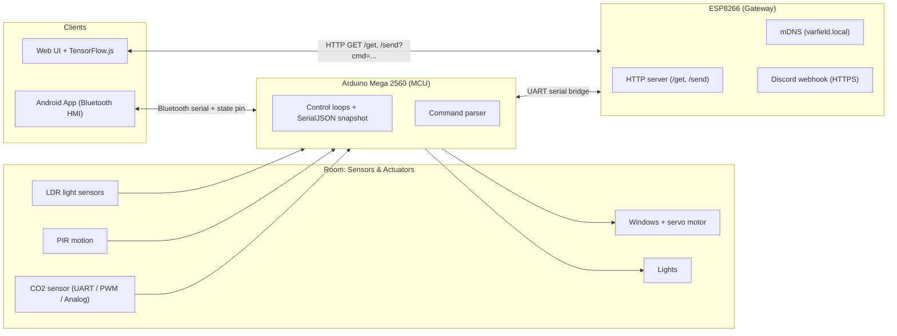

# Smart Environment Control System & Empirical Analysis (2022–2024)


> This repository contains the source code, firmware, and research data for a multi-year engineering project awarded at the *Jugend Forscht* competition. It demonstrates a complete IoT stack evolution—from statistical analysis (2022) to embedded hardware engineering (2023) and finally Neural Network integration (2024).

---

## Mobile Interface & System Visualization

The user interface was built to provide real-time telemetry and manual overrides for the automated hardware.

| **Main Dashboard** | **Lighting Control** | **Connection/Logs** |
|:---:|:---:|:---:|
|  |  |  |
| *Real-time CO₂ telemetry & Window State* | *Adaptive Lighting & Threshold Configuration* | *Bluetooth Handshake & Debug Logs* |

---

## Technical Architecture

The system operates as a distributed IoT network with three distinct layers:

### 1. Hardware Layer (Embedded C++)
* **Master Controller:** Arduino Mega 2560 handling sensor fusion (MH-Z14A CO₂, PIR, LDR) and actuator logic (Servos, LEDs).
* **Gateway:** ESP8266 handling WiFi connectivity and Discord Webhooks.
* **Protocol:** Custom serial command protocol with a JSON telemetry snapshot (`j` command) for robust state synchronization.

### 2. Software Layer (Android)
* **Frontend:** Custom Android application (MIT App Inventor) serving as the primary HMI (Human-Machine Interface).
* **Logic:** Handles threshold management, manual overrides, and visualizes `SerialJSON` data streams.

### 3. Intelligence Layer (Web & AI)
* **TensorFlow.js:** A browser-based Neural Network (Dense Layer Architecture: 14 $\rightarrow$ 16 $\rightarrow$ 8 $\rightarrow$ 5) with interactive training/visualization for predicting lighting + ventilation actions from time, presence, and sensor inputs.



---

## Project Evolution & Key Engineering Challenges

### 2024: Remote Control & Web Intelligence (Phase III)
**Challenge:** Bridging real-time telemetry + control over WiFi.
* **Problem:** I needed a reliable way to read a full system snapshot in the browser and send control commands back to the Arduino without desynchronization, while also keeping the setup usable on a local network.
* **Solution:** Implemented an ESP8266 gateway with mDNS (`varfield.local`) and a minimal HTTP API (`/get` for JSON snapshots, `/send?cmd=...` for command forwarding), plus CORS headers for browser access.
* **Feature:** Built the web dashboard (table + localStorage history) and integrated a TensorFlow.js training/visualization UI for predicting light/window actions.

### 2023: Effective Digital CO₂ Control (Phase II)
**Challenge:** Reliable control under tight embedded constraints.
* **Problem:** Sending raw comma-separated values resulted in desynchronization between the App and the Arduino.
* **Solution:** Engineered a custom C++ serializer (`SerialJSON`) so clients always receive a complete JSON "snapshot" (CO₂ readings, states, thresholds, timing).
* **Problem:** The standard Arduino `Servo.h` library uses **Timer1**, which can conflict with software serial workloads (e.g., Bluetooth), causing jitter and communication issues.
* **Solution:** Switched to **`ServoTimer2.h`** to drive the servo from **Timer2**, allowing stable serial communication alongside precise actuator control.

### 2022: Efficiency of CO₂ Measures (Phase I)
**Focus:** Data Science.
* Conducted empirical analysis of classroom ventilation strategies.
* **Result:** Modeled decay curves proving "Shock Ventilation" (10 mins wide open) is statistically superior to "Continuous Tilted Ventilation" for CO₂ reduction.

---

## Code Highlights

### Custom Serial JSON Serialization (C++)
To ensure memory safety on the microcontroller while maintaining a standard data format for the App and Web interface, I wrote a manual serializer rather than using heavy libraries.

```cpp
// From firmware/JuFo_MCU/JuFo_MCU.ino
void SerialJSON(String message, Stream *selectedSerial) {
  // Efficient string concatenation for embedded systems
  // Constructs a valid JSON payload for the Android App parser
  String concatV = toJSONbool(VentanaState, TotalVentanas); 
  String concatL = toJSONbool(LightState, TotalLights);
  
  String JSONdata = 
  (
    "{\"ppm_a\":" + String(ppm_analog) 
  + ",\"ppm_u\":" + String(ppm_uart) 
  + ",\"windows\":" + concatV 
  + ",\"lights\":" + concatL
  + ",\"lastMotionD\":" + (millis() - lastMotion) 
  + ",\"message\":\"" + message + "\"}"
  );
  selectedSerial->print(JSONdata);
}

```

### Telemetry Schema & Control Endpoints

The ESP8266 exposes a tiny HTTP API and forwards commands to the Mega over the serial bridge:

* `GET /get` → requests a JSON snapshot from the Mega (by sending `j`) and returns it as `application/json`.
* `GET /send?cmd=...` → forwards a command string to the Mega (examples used by the web UI include `sl...` for light control and `ltN` to set the light threshold).

The JSON snapshot returned by `SerialJSON(...)` includes (among others):

* `ppm_a`, `ppm_u`, `ppm_p`
* `windows` (array), `lights` (array)
* `threshold`, `lightThreshold`
* `servoangle`, `motorAllowed`, `lightAllowed`
* `lastMotionD` (ms since last motion), `BTsts` (Bluetooth state pin)
* `message`

### Discord Intrusion Detection (ESP8266)

The system acts as a security device when the user is away, pushing alerts via HTTPS to a Discord Webhook.

```cpp
// From firmware/JuFo_ESP/JuFo_ESP.ino
void alertNewPerson(String discordMsg) {
  HTTPClient http;
  http.begin(client, "REDACTED_DISCORD_WEBHOOK");
  http.addHeader("Content-Type", "application/json");
  // Payload construction for Discord API
  String payload = "{\"username\": \"SMART HOME\", \"content\": \""+discordMsg+ "\", \"tts\":true }";
  int httpResponseCode = http.POST(payload);
}

```

---

## Repository Structure

* `firmware/` - Embedded firmware
  * `JuFo_MCU/` - Arduino Mega logic (sensors, servo/window control, lighting, JSON telemetry)
  * `JuFo_ESP/` - ESP8266 gateway (HTTP API, mDNS, Discord webhook)
* `web_interface/` - Browser dashboard + TensorFlow.js prototype
* `assets/` - Screenshots and diagrams

---

## Awards & Recognition

* **1st Prize Regional Competition** - Math/Computer Science (2024)
* **3rd Prize State Competition** - Math/Computer Science (2024)
* **1st Prize Regional Competition** - Technology (2023)
* **plusMINT Special Prize** for Interdisciplinary Projects (2023)

---

*Authored by Victor Gurbani | 2022-2024*

